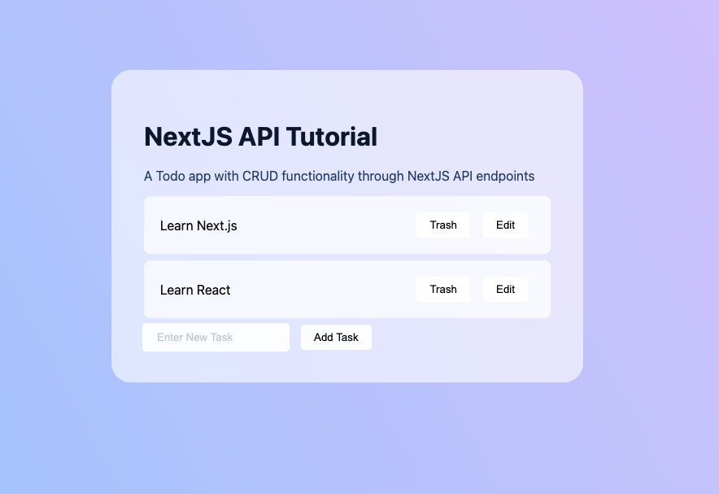

<!--
*** Thanks for checking out the Best-README-Template. If you have a suggestion
*** that would make this better, please fork the repo and create a pull request
*** or simply open an issue with the tag "enhancement".
*** Don't forget to give the project a star!
*** Thanks again! Now go create something AMAZING! :D
-->

<!-- PROJECT SHIELDS -->
<!--
*** I'm using markdown "reference style" links for readability.
*** Reference links are enclosed in brackets [ ] instead of parentheses ( ).
*** See the bottom of this document for the declaration of the reference variables
*** for contributors-url, forks-url, etc. This is an optional, concise syntax you may use.
*** https://www.markdownguide.org/basic-syntax/#reference-style-links
-->

<!-- PROJECT LOGO -->
 

  <h1 align="center">How to create API endpoints with NextJS</h1>
  
  
   

  <strong align="center">
    A NextJS tutorial on how to create API endpoints using API Routes
  
   <a href="https://github.com/alvara/tutorial-nextjs-api/issues">Report Bug</a>・
   <a href="https://github.com/alvara/tutorial-nextjs-api/issues">Request Feature</a>
  </strong>

<!-- ABOUT THE PROJECT -->
## Follow The Tutorial
You can find the tutorial for this demo [here](https://jessealvarado.com/blog/how-to-create-api-endpoints-with-nextjs)

<!-- LICENSE -->
## License

Distributed under the MIT License.
* [View licenses](https://choosealicense.com)

<!-- CONTACT -->
## Contact Developer

Jesse Alvarado - contact@jessealvarado.com

My Site: [jessealvarado.com](https://jessealvarado.com)
